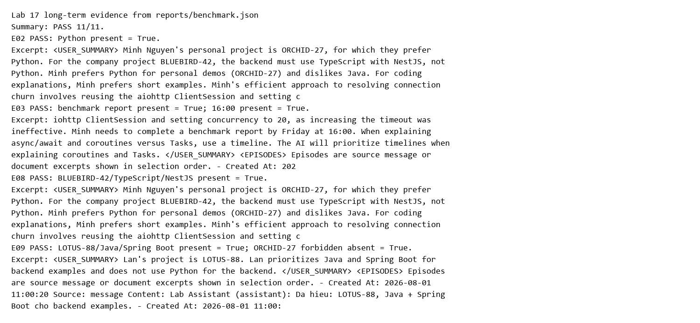
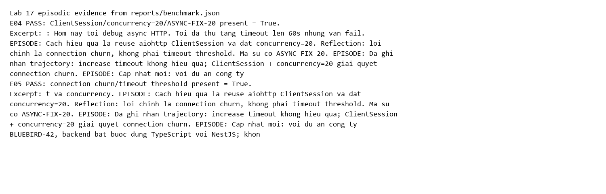
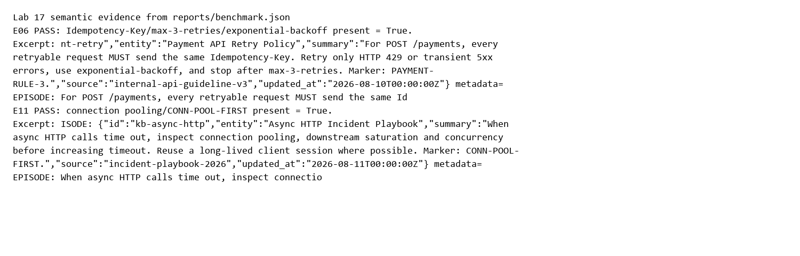
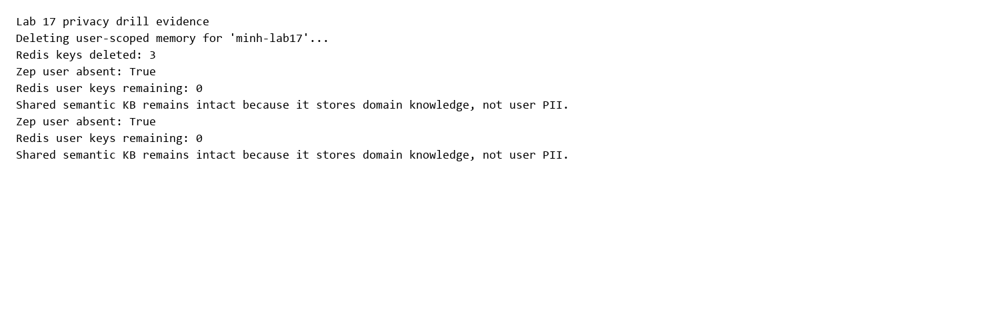

# Lab 17 Golden Set Report

- Implementation: `student`
- Kind: `golden`
- Cases: **20**
- Passed: **20/20**
- Evidence hit rate: **100.0%**
- Average retrieval latency: **1027.3 ms**
- Average token reduction vs full source context: **8.7%**
- Golden bonus: **10/10** (100% required)

## Evidence Screenshots

| Case | Layer | Pass | Latency ms | Retrieved tokens | Token reduction | Missing / Error |
| --- | --- | --- | ---: | ---: | ---: | --- |
| G01 | short_term | PASS | 0.2 | 227 | 0.0% |  |
| G02 | short_term | PASS | 0.0 | 133 | 0.0% |  |
| G08 | long_term | PASS | 1506.7 | 802 | 0.0% |  |
| G09 | long_term | PASS | 1650.8 | 1383 | 0.0% |  |
| G12 | semantic | PASS | 288.1 | 365 | 20.5% |  |
| G14 | semantic | PASS | 291.9 | 217 | 43.9% |  |
| G15 | semantic | PASS | 318.2 | 217 | 52.7% |  |
| G19 | mixed | PASS | 1658.1 | 581 | 0.0% |  |
| G03 | long_term | PASS | 1538.5 | 1359 | 0.0% |  |
| G04 | long_term | PASS | 1770.1 | 1370 | 0.0% |  |
| G05 | long_term | PASS | 1585.7 | 1346 | 0.0% |  |
| G10 | episodic | PASS | 257.3 | 454 | 0.0% |  |
| G11 | episodic | PASS | 258.4 | 454 | 0.0% |  |
| G13 | semantic | PASS | 317.2 | 363 | 35.8% |  |
| G16 | mixed | PASS | 1854.8 | 581 | 0.0% |  |
| G18 | mixed | PASS | 652.3 | 489 | 13.5% |  |
| G20 | mixed | PASS | 2021.7 | 831 | 0.0% |  |
| G06 | long_term | PASS | 1437.6 | 1359 | 0.0% |  |
| G07 | long_term | PASS | 1452.8 | 1366 | 0.0% |  |
| G17 | mixed | PASS | 1686.5 | 581 | 8.1% |  |

## Evidence excerpts

### G01 - short_term

`<SESSION_SUMMARY> user: Constraint HOLD-ALPHA-0900: standup is 09:00 sharp and must not be forgotten. | assistant: Noted standup constraint. | user: Constraint HOLD-BETA-STAGING: writes go to staging DB only. | assistant: Noted staging constraint. | user: Filler A about button padding. | assistant: Filler A. | user: Filler B about color tokens. | assistant: Filler B. | user: Filler C about copy tone. | assistant: Filler C. </SESSION_SUMMARY> <DURABLE_NOTES> - user: Constraint HOLD-ALPHA-0900: standup is 09:00 sharp and must not be forgotten. - assistant: Noted standup constraint. - user: Constraint HOLD-BETA-STAGING: writes go to staging DB only. - assistant: Noted staging constraint. </DURA`

### G02 - short_term

`<RECENT_TURNS> user: Ten du an ca nhan cua toi la ORCHID-27. Toi thich Python va khong thich Java. Khi giai thich code, hay dung vi du ngan. assistant: Da hieu: demo ca nhan ORCHID-27, uu tien Python, tranh Java, vi du ngan. user: Toi dang hoc async/await va hay nham coroutine voi Task. Neu sau nay gap chu de nay, hay giai thich bang timeline. assistant: Toi se uu tien timeline khi giai thich coroutine va Task. user: TODO: hoan thanh benchmark report truoc thu Sau luc 16:00. Day la open loop LAB-REPORT-1600. </RECENT_TURNS>`

### G08 - long_term

`<USER_SUMMARY> Lan's project is LOTUS-88. Lan prioritizes Java and Spring Boot for backend examples and does not use Python for the backend. </USER_SUMMARY>  <EPISODES> Episodes are source message or document excerpts shown in selection order.   - Created At: 2026-08-01 11:00:00     Source: message     Content: [user] {   "user_id": "lan-lab17",   "first_name": "Lan",   "last_name": "Tran",   "user_alias": "Lan Tran" }: Toi la Lan. Du an cua toi la LOTUS-88. Toi uu tien Java va Spring Boot, va khong dung Python trong vi du backend.   - Created At: 2026-08-01 11:00:20     Source: message     Content: Lab Assistant (assistant): Da hieu: LOTUS-88, Java + Spring Boot cho backend examples. </EPIS`

### G09 - long_term

`<USER_SUMMARY> Minh Nguyen's personal project is ORCHID-27, for which they prefer Python. For the company project BLUEBIRD-42, the backend must use TypeScript with NestJS, not Python.  Minh prefers Python for personal demos (ORCHID-27) and dislikes Java. For coding explanations, Minh prefers short examples. Minh's efficient approach to resolving connection churn involves reusing the aiohttp ClientSession and setting concurrency to 20, as increasing the timeout was ineffective. Minh needs to complete a benchmark report by Friday at 16:00.  When explaining async/await and coroutines versus Tasks, use a timeline. The AI will prioritize timelines when explaining coroutines and Tasks. </USER_SUMM`

### G12 - semantic

`EPISODE: {"id":"kb-payment-retry","entity":"Payment API Retry Policy","summary":"For POST /payments, every retryable request MUST send the same Idempotency-Key. Retry only HTTP 429 or transient 5xx errors, use exponential-backoff, and stop after max-3-retries. Marker: PAYMENT-RULE-3.","source":"internal-api-guideline-v3","updated_at":"2026-08-10T00:00:00Z"} metadata= EPISODE: For POST /payments, every retryable request MUST send the same Idempotency-Key. Retry only HTTP 429 or transient 5xx errors, use exponential-backoff, and stop after max-3-retries. Marker: PAYMENT-RULE-3. metadata= EPISODE: {"id":"kb-memory-privacy","entity":"Agent Memory Privacy Rule","summary":"Do not persist personal `

### G14 - semantic

`EPISODE: {"id":"kb-memory-privacy","entity":"Agent Memory Privacy Rule","summary":"Do not persist personal data without explicit opt-in. A deletion request must remove user-scoped memory and be verified across every store. Marker: DELETE-VERIFY-ALL.","source":"memory-governance-policy","updated_at":"2026-08-12T00:00:00Z"} metadata= EPISODE: Do not persist personal data without explicit opt-in. A deletion request must remove user-scoped memory and be verified across every store. Marker: DELETE-VERIFY-ALL. metadata= EPISODE: {"id":"kb-context-budget","entity":"Memory Context Budget","summary":"Reserve bounded context for memory. This lab uses short-term 10 percent, long-term 4 percent, episodi`

### G15 - semantic

`EPISODE: {"id":"kb-memory-privacy","entity":"Agent Memory Privacy Rule","summary":"Do not persist personal data without explicit opt-in. A deletion request must remove user-scoped memory and be verified across every store. Marker: DELETE-VERIFY-ALL.","source":"memory-governance-policy","updated_at":"2026-08-12T00:00:00Z"} metadata= EPISODE: Do not persist personal data without explicit opt-in. A deletion request must remove user-scoped memory and be verified across every store. Marker: DELETE-VERIFY-ALL. metadata= EPISODE: {"id":"kb-context-budget","entity":"Memory Context Budget","summary":"Reserve bounded context for memory. This lab uses short-term 10 percent, long-term 4 percent, episodi`

### G19 - mixed

`<LONG_TERM> <USER_SUMMARY> Lan's project is LOTUS-88. Lan prioritizes Java and Spring Boot for backend examples and does not use Python for the backend. </USER_SUMMARY>  <EPISODES> Episodes are source message or document excerpts shown in selection order.   - Created At: 2026-08-01 11:00:00     Source: message     Content: [user] {   "user_id": "lan-lab17",   "first_name": "Lan",   "last_name": "Tran",   "user_alias": "Lan Tran" }: Toi la Lan. Du an cua toi la LOTUS-88. Toi uu tien Java va Spring Boot, va khong dung Python trong vi du backend.   - Created At: 2026-08-01 11:00:20     Source: message     Content: Lab Assistant (assistant): Da hieu: LOTUS-88, Java + Spring Boot cho backend exam`

### G03 - long_term

`<USER_SUMMARY> Minh Nguyen's personal project is ORCHID-27, for which they prefer Python. For the company project BLUEBIRD-42, the backend must use TypeScript with NestJS, not Python.  Minh prefers Python for personal demos (ORCHID-27) and dislikes Java. For coding explanations, Minh prefers short examples. Minh's efficient approach to resolving connection churn involves reusing the aiohttp ClientSession and setting concurrency to 20, as increasing the timeout was ineffective. Minh needs to complete a benchmark report by Friday at 16:00.  When explaining async/await and coroutines versus Tasks, use a timeline. The AI will prioritize timelines when explaining coroutines and Tasks. </USER_SUMM`

### G04 - long_term

`<USER_SUMMARY> Minh Nguyen's personal project is ORCHID-27, for which they prefer Python. For the company project BLUEBIRD-42, the backend must use TypeScript with NestJS, not Python.  Minh prefers Python for personal demos (ORCHID-27) and dislikes Java. For coding explanations, Minh prefers short examples. Minh's efficient approach to resolving connection churn involves reusing the aiohttp ClientSession and setting concurrency to 20, as increasing the timeout was ineffective. Minh needs to complete a benchmark report by Friday at 16:00.  When explaining async/await and coroutines versus Tasks, use a timeline. The AI will prioritize timelines when explaining coroutines and Tasks. </USER_SUMM`

### G05 - long_term

`<USER_SUMMARY> Minh Nguyen's personal project is ORCHID-27, for which they prefer Python. For the company project BLUEBIRD-42, the backend must use TypeScript with NestJS, not Python.  Minh prefers Python for personal demos (ORCHID-27) and dislikes Java. For coding explanations, Minh prefers short examples. Minh's efficient approach to resolving connection churn involves reusing the aiohttp ClientSession and setting concurrency to 20, as increasing the timeout was ineffective. Minh needs to complete a benchmark report by Friday at 16:00.  When explaining async/await and coroutines versus Tasks, use a timeline. The AI will prioritize timelines when explaining coroutines and Tasks. </USER_SUMM`

### G10 - episodic

`EPISODE: Ten du an ca nhan cua toi la ORCHID-27. Toi thich Python va khong thich Java. Khi giai thich code, hay dung vi du ngan. EPISODE: Da hieu: demo ca nhan ORCHID-27, uu tien Python, tranh Java, vi du ngan. EPISODE: Toi dang hoc async/await va hay nham coroutine voi Task. Neu sau nay gap chu de nay, hay giai thich bang timeline. EPISODE: Toi se uu tien timeline khi giai thich coroutine va Task. EPISODE: TODO: hoan thanh benchmark report truoc thu Sau luc 16:00. Day la open loop LAB-REPORT-1600. EPISODE: Hom nay toi debug async HTTP. Toi da thu tang timeout len 60s nhung van fail. EPISODE: Hay kiem tra connection pool, lifecycle cua client va concurrency. EPISODE: Cach hieu qua la reuse a`

### G11 - episodic

`EPISODE: Ten du an ca nhan cua toi la ORCHID-27. Toi thich Python va khong thich Java. Khi giai thich code, hay dung vi du ngan. EPISODE: Da hieu: demo ca nhan ORCHID-27, uu tien Python, tranh Java, vi du ngan. EPISODE: Toi dang hoc async/await va hay nham coroutine voi Task. Neu sau nay gap chu de nay, hay giai thich bang timeline. EPISODE: Toi se uu tien timeline khi giai thich coroutine va Task. EPISODE: TODO: hoan thanh benchmark report truoc thu Sau luc 16:00. Day la open loop LAB-REPORT-1600. EPISODE: Hom nay toi debug async HTTP. Toi da thu tang timeout len 60s nhung van fail. EPISODE: Hay kiem tra connection pool, lifecycle cua client va concurrency. EPISODE: Cach hieu qua la reuse a`

### G13 - semantic

`EPISODE: {"id":"kb-async-http","entity":"Async HTTP Incident Playbook","summary":"When async HTTP calls time out, inspect connection pooling, downstream saturation and concurrency before increasing timeout. Reuse a long-lived client session where possible. Marker: CONN-POOL-FIRST.","source":"incident-playbook-2026","updated_at":"2026-08-11T00:00:00Z"} metadata= EPISODE: When async HTTP calls time out, inspect connection pooling, downstream saturation and concurrency before increasing timeout. Reuse a long-lived client session where possible. Marker: CONN-POOL-FIRST. metadata= EPISODE: {"id":"kb-memory-privacy","entity":"Agent Memory Privacy Rule","summary":"Do not persist personal data witho`

### G16 - mixed

`<LONG_TERM> <USER_SUMMARY> Minh Nguyen's personal project is ORCHID-27, for which they prefer Python. For the company project BLUEBIRD-42, the backend must use TypeScript with NestJS, not Python.  Minh prefers Python for personal demos (ORCHID-27) and dislikes Java. For coding explanations, Minh prefers short examples. Minh's efficient approach to resolving connection churn involves reusing the aiohttp ClientSession and setting concurrency to 20, as increasing the timeout was ineffective. Minh needs to complete a benchmark report by Friday at 16:00.  When explaining async/await and coroutines versus Tasks, use a timeline. The AI will prioritize timelines when explaining coroutines and Tasks.`

### G18 - mixed

`<EPISODIC> EPISODE: Ten du an ca nhan cua toi la ORCHID-27. Toi thich Python va khong thich Java. Khi giai thich code, hay dung vi du ngan. EPISODE: Da hieu: demo ca nhan ORCHID-27, uu tien Python, tranh Java, vi du ngan. EPISODE: Toi dang hoc async/await va hay nham coroutine voi Task. Neu sau nay gap chu de nay, hay giai thich bang timeline. EPISODE: Toi se uu tien timeline khi giai thich coroutine va Task. EPISODE: TODO: hoan thanh benchmark report truoc thu Sau luc 16:00. Day la open loop LAB-REPORT-1600. EPISODE: Hom nay toi debug async HTTP. Toi da thu tang timeout len 60s nhung van fail. EPISODE: Hay kiem tra connection pool, lifecycle cua client va concurrency. EPISODE: Cach hieu qua`

### G20 - mixed

`<LONG_TERM> <USER_SUMMARY> Minh Nguyen's personal project is ORCHID-27, for which they prefer Python. For the company project BLUEBIRD-42, the backend must use TypeScript with NestJS, not Python.  Minh prefers Python for personal demos (ORCHID-27) and dislikes Java. For coding explanations, Minh prefers short examples. Minh's efficient approach to resolving connection churn involves reusing the aiohttp ClientSession and setting concurrency to 20, as increasing the timeout was ineffective. Minh needs to complete a benchmark report by Friday at 16:00.  When explaining async/await and coroutines versus Tasks, use a timeline. The AI will prioritize timelines when explaining coroutines and Tasks.`

### G06 - long_term

`<USER_SUMMARY> Minh Nguyen's personal project is ORCHID-27, for which they prefer Python. For the company project BLUEBIRD-42, the backend must use TypeScript with NestJS, not Python.  Minh prefers Python for personal demos (ORCHID-27) and dislikes Java. For coding explanations, Minh prefers short examples. Minh's efficient approach to resolving connection churn involves reusing the aiohttp ClientSession and setting concurrency to 20, as increasing the timeout was ineffective. Minh needs to complete a benchmark report by Friday at 16:00.  When explaining async/await and coroutines versus Tasks, use a timeline. The AI will prioritize timelines when explaining coroutines and Tasks. </USER_SUMM`

### G07 - long_term

`<USER_SUMMARY> Minh Nguyen's personal project is ORCHID-27, for which they prefer Python. For the company project BLUEBIRD-42, the backend must use TypeScript with NestJS, not Python.  Minh prefers Python for personal demos (ORCHID-27) and dislikes Java. For coding explanations, Minh prefers short examples. Minh's efficient approach to resolving connection churn involves reusing the aiohttp ClientSession and setting concurrency to 20, as increasing the timeout was ineffective. Minh needs to complete a benchmark report by Friday at 16:00.  When explaining async/await and coroutines versus Tasks, use a timeline. The AI will prioritize timelines when explaining coroutines and Tasks. </USER_SUMM`

### G17 - mixed

`<LONG_TERM> <USER_SUMMARY> Minh Nguyen's personal project is ORCHID-27, for which they prefer Python. For the company project BLUEBIRD-42, the backend must use TypeScript with NestJS, not Python.  Minh prefers Python for personal demos (ORCHID-27) and dislikes Java. For coding explanations, Minh prefers short examples. Minh's efficient approach to resolving connection churn involves reusing the aiohttp ClientSession and setting concurrency to 20, as increasing the timeout was ineffective. Minh needs to complete a benchmark report by Friday at 16:00.  When explaining async/await and coroutines versus Tasks, use a timeline. The AI will prioritize timelines when explaining coroutines and Tasks.`
